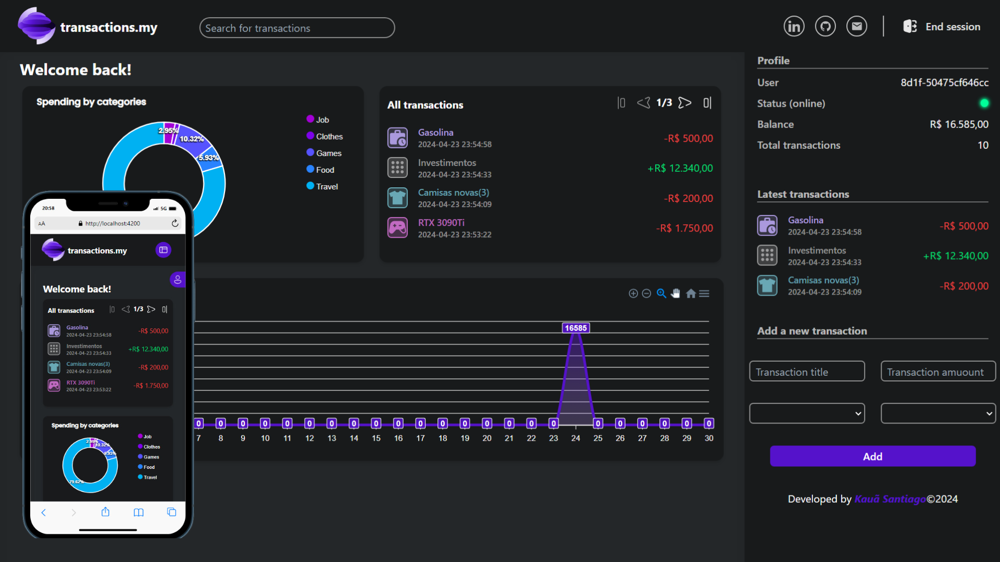

# transactions.my

**Sobre:** o _transactions.my_ foi criado com o inutuito de ajudar as pessoas a terem uma melhor
orgaização dos seus gastosm, além disso, também o criei com o intuito de testar minhas habilidades.
é um app simples, mas intuitivo e fácil de entender, não é necessário realizar o login nele, basta criar
uma transação e você recebe um session id por meio de cookies que permite você ser identificado pelo servidor.

- **Tecnologias:**
  - Angular 17 e standalone components
  - Apexchart
  - Tailwind CSS
  - API REST feita por mim
